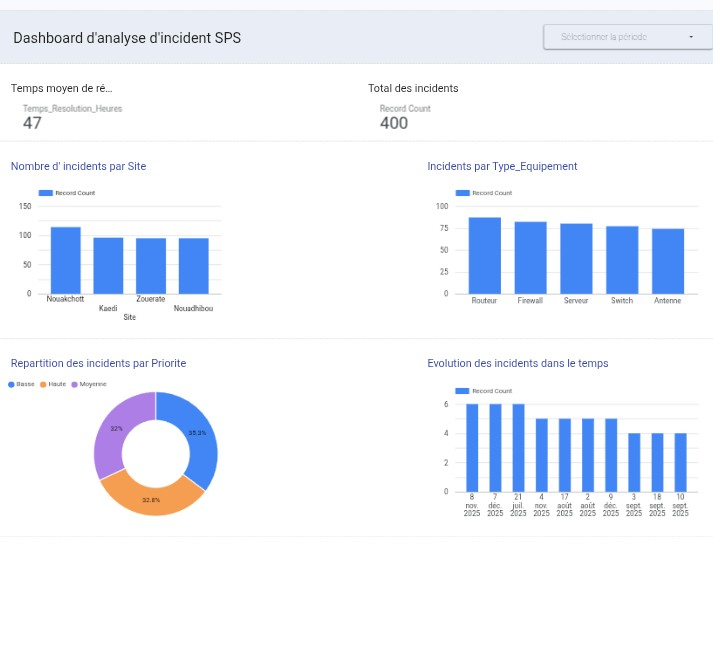

#  IT Incident Analysis SPS ( local company )

## 🎯 Project Overview
This project simulates a real-world IT Data Analyst workflow. It focuses on monitoring and analyzing technical incidents (Routers, Firewalls, Switches) to optimize the **Mean Time To Resolution (MTTR)** and identify operational bottlenecks.

## 📈 Dashboard Preview
 
*Interactive dashboard built with Google Data Studio.*

## 🛠️ Technical Stack
*   Python: Synthetic data generation using `pandas` and `random` libraries.
*   Excel: Data cleaning, normalization, and KPI structuring.
*   Looker Studio: Interactive data visualization and reporting.
*   GitHub: Project documentation and version control.

## 🔍 Key Business Insights
*   Geographic Focus: Nouakchott records the highest volume of incidents, suggesting a need for increased technician allocation in this area.
*   Equipment Reliability: Routers and Firewalls are the most frequent points of failure.
*   Performance: The current average resolution time is **47 hours**. High-priority incidents are being monitored to reduce this delay.

## 🚀 How to Run the Project
1. Clone the repository.
2. Install dependencies: `pip install pandas`.
3. Run the generator: `python Scripts/generator.py` to create a fresh dataset.
4. Import the generated `SPS_incidents_data.xlsx` into Looker Studio.

*Developed by **Boubacar-tech** as part of a Data Analytics Portfolio.*
